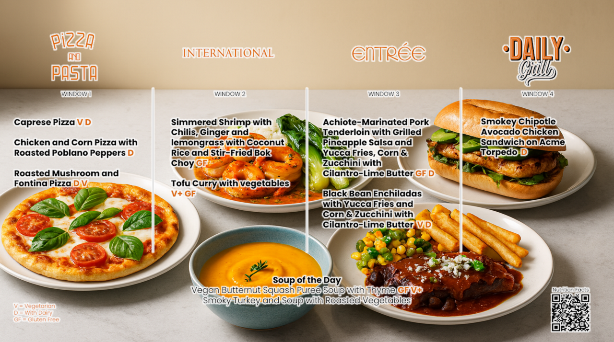

# Verkadalizer Chrome Extension

A Chrome extension that processes food menu images from Verkada Menu pages using OpenAI's Image Edit API to create beautiful, appetizing visualizations of menu items.

## Features

- **Automatic Image Detection**: Automatically detects menu images on Verkada Menu pages (`https://sites.google.com/verkada.com/verkada-menu`) by filtering for Google User Content images with specific parameters
- **Manual Processing**: Click individual ✨🍕 buttons on each menu image to process them one by one
- **Configurable Output Size**: Choose OpenAI output size (1024x1024, 1536x1024, 1024x1536). Default is 1536×1024
- **Visual Feedback**: Shows animated spinner overlays during processing with branded styling
- **Settings Management**: Configure OpenAI API key, model, and custom prompts through the extension popup
- **Image Preservation**: Maintains original image dimensions through intelligent canvas resizing
- **Error Handling**: Comprehensive error handling with fallback mechanisms

## Installation

1. Clone or download repository `https://github.com/siropkin/verkadalizer`
2. Open Chrome and navigate to `chrome://extensions/`
3. Enable "Developer mode"
4. Click "Load unpacked" and select the extension directory
5. Configure your OpenAI API key in the extension popup

## Configuration

Click the extension icon to configure:

- **OpenAI API Key**: Your personal API key (stored locally)
- **Model**: Default is `gpt-image-1` (OpenAI's image editing model)
- **Processing Prompt**: Customize how the AI processes menu images
- **Output Size**: Choose output image size for OpenAI edits (default 1536×1024)

## How It Works

1. **Image Detection**: Scans pages for images hosted on `googleusercontent.com` with the `=w1280` parameter (typical for Verkada Menu images)
2. **Button Injection**: Adds colorful ✨🍕 processing buttons to each detected menu image
3. **Image Processing**:
   - Fetches the original image and converts to base64
   - Sends to OpenAI's Image Edit API with the configured prompt
   - Receives processed image with food visualizations
   - Replaces original image while maintaining dimensions
4. **Visual Enhancement**: Uses canvas manipulation to ensure processed images fit perfectly in the original layout

## Technical Details

- **Manifest Version**: 3 (latest Chrome extension standard)
- **Permissions**: `activeTab`, `storage`
- **Host Permissions**: Verkada Menu pages, OpenAI API, Google User Content
- **Architecture**: Content script + service worker + popup interface
- **Image Processing**: Base64 encoding, FormData API, Canvas resizing
